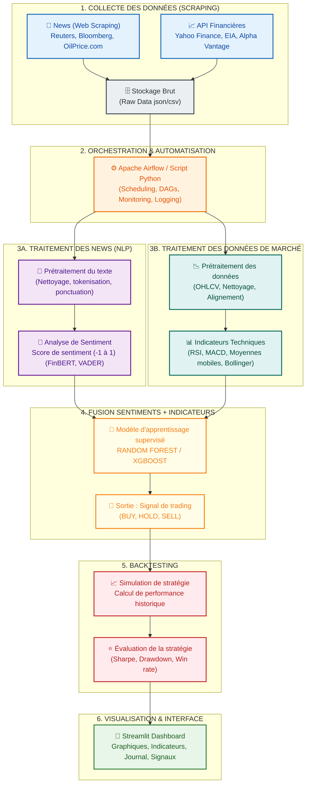

# 🛢️ Rapport de Pipeline - Trading Algorithmique WTI Crude Oil

Ce document décrit le fonctionnement global et l'architecture technique du pipeline de trading algorithmique mis en place pour ce TP.

---

## 📊 Représentation Graphique du Pipeline

---

## 📝 Description Étape par Étape

### 1. Collecte des Données (Scraping)
* **Actualités (NLP) :** Récupération automatique d'articles et de titres à partir de sites d'information financière clés (comme *OilPrice.com*, *Reuters*, *Bloomberg*). Ces données sont stockées au format brut pour alimenter le pipeline de traitement de langage naturel.
* **API Financières :** Téléchargement des données de prix historiques (données quotidiennes et horaires OHLCV - Open, High, Low, Close, Volume) à partir de Yahoo Finance, de l'EIA (Energy Information Administration) et d'autres APIs financières.
* **Fichiers intermédiaires :** Fichiers enregistrés dans `scraping/src/data/raw/`.

### 2. Orchestration & Automatisation
* Orchestration complète du flux à l'aide d'**Apache Airflow** (ou via des scripts d'automatisation Python comme `scraping/src/main.py` et `ai/nlp/run.py`).
* Automatisation de l'exécution récurrente des tâches (Scheduling), création de DAGs de dépendance, surveillance en temps réel (Monitoring) et journalisation centralisée (Logging).

### 3A. Traitement des Nouvelles (NLP)
* **Prétraitement :** Nettoyage des textes, suppression des caractères spéciaux, tokenisation et classification des articles selon la pertinence par rapport au pétrole (`oil_density`).
* **Classification par actif :** Identification automatique de l'impact sur le **WTI** ou le **Brent** par reconnaissance de mots-clés.
* **Analyse de Sentiment :** Utilisation de modèles de pointe comme **FinBERT** (réseau de neurones spécialisé dans la finance) et **VADER** (analyse lexicale) pour obtenir un score de sentiment continu (de `-1` très négatif à `+1` très positif).
* **Agrégation journalière :** Compilation des sentiments quotidiens pondérés par la pertinence et le niveau de confiance du modèle.

### 3B. Traitement des Données de Marché
* **Prétraitement :** Nettoyage des données historiques de prix, gestion des valeurs manquantes et synchronisation temporelle.
* **Indicateurs Techniques :** Calcul d'indicateurs classiques pour le trading quantitatif :
  * **Moyennes Mobiles (SMA/EMA) :** Suivi de tendance à court/moyen terme.
  * **RSI (Relative Strength Index) :** Identification des zones de surachat/survente.
  * **MACD (Moving Average Convergence Divergence) :** Dynamique de tendance.
  * **Bandes de Bollinger :** Volatilité des prix.

### 4. Fusion Sentiments + Indicateurs
* Regroupement des indicateurs techniques de prix et des signaux de sentiment NLP agrégés.
* Entraînement d'un modèle d'apprentissage supervisé : **Random Forest** (Forêt d'arbres décisionnels) ou **XGBoost**.
* **Sortie du modèle :** Génération d'un signal de trading quotidien : `BUY` (Achat), `HOLD` (Conserver), ou `SELL` (Vente).

### 5. Backtesting
* Simulation historique de la stratégie de trading sur les données passées pour évaluer sa rentabilité.
* Calcul précis des métriques de performance et de risque clés :
  * **Ratio de Sharpe :** Performance ajustée au risque.
  * **Maximum Drawdown (MDD) :** Perte maximale historique subie depuis un sommet.
  * **Win Rate :** Taux de réussite des transactions.
  * **CAGR :** Taux de croissance annuel composé.

### 6. Visualisation & Interface
* Interface utilisateur interactive développée sous **Streamlit** accessible localement (port `8501`).
* **Fonctionnalités :**
  * **Recommandation :** Verdict clair en temps réel avec score de confiance.
  * **Analyse de prix :** Graphiques interactifs Plotly avec options d'affichage des indicateurs techniques.
  * **Backtest :** Courbes d'équité et analyse comparée par rapport à une stratégie *Buy & Hold*.
  * **Journal des transactions :** Suivi et historique des signaux générés.
